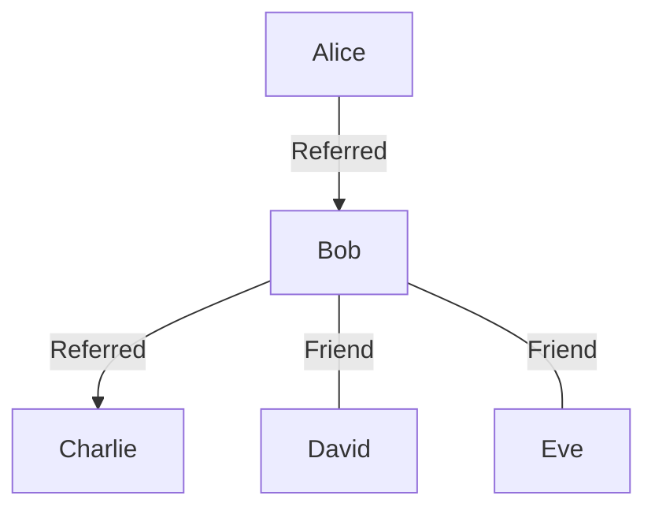

# The Zentry Challenge

Hi and congratulations on your progress with Zentry!

# Requirements (Glossary below)

Your objective is to design and implement a social network data analytics platform for a social network site **Bacefook**.

Bacefook has a small, ambitious social network platform. Your goal is to help them implement the analytics part and the visualization thereof based on events emitted by their core module. Eventually the product team would like to be able to:

## Analytics Page

1. Display a network of relationship between a given user and their relationships. A relationship is both the referrer of a user, the users this user referred, and all friends of the user. The product team would like to be able to query for such a relationship given just the user's name and see a nice graph. Preferrably, the frontend should be able to render the graph and handle interactions comfortable with no frame drops (initial janks are acceptable).

For example, a query for user Bob—who was referred by Alice, has referred Charlie, and is friends with David and Eve—can be visualized as follows:



2. Display `network strength` ranking in a leaderboard-like list. This leaderboard should show a ranked list based on user with the most `network strength` within any time range.

3. Display the user's `referral points` ranking in a leaderboard-like list. This leaderboard should show a ranked list based on user with the most `referral points` within any time range.

## User Profile

1. The user profile should show
   1. the user's `name`
   2. user's referral timeseries graph given any time range.
   3. user's referral count given any timerange.
   4. user's friends count timeseries graph given any time range
   5. user's friends count given any timerange.

2. Display top 3 **influential friends**.

3. Display a paginated list of user's friends.

# Understanding

Your platform will show data generated by the `bacefook-core` module.

`modules/bacefok-core/index.ts` exports an async generator. The generator is designed to generate infinite number of events.

Your task is to create a durable workflow that periodically stream data using this generator, transform the data, store it in a database and visualize it.

`generator.stream()` will generate the following events for each iteration

```ts
/**
 * Represents new user enrollment
 */
interface RegisterEvent {
    type: "register";
    name: string;
    created_at: string;
}

/**
 * Represents a fact that user a refers user b
 */
interface ReferralEvent {
    type: "referral";
    referredBy: string;
    user: string;
    created_at: string;
}

/*
* Represent new un-directed friendship between two users.
*/
interface AddFriendEvent {
    type: "addfriend";
    user1_name: string;
    user2_name: string;
    created_at: string;
}

/*
* Removes existing un-directed relationship.
*/
interface UnfriendEvent {
    type: "unfriend";
    user1_name: string;
    user2_name: string;
    created_at: string;
}
```

The first iteration won't contain any unfriend event so you may have to call it more than once to test unfriend events.

As an example, your modules at the end might contain
- A workflow module for cron jobs that pull in data and store them
- Another workflow for picking up the data and transform it
- Backend for querying the data
- Frontend for visualization

Your structure might differ, we leave this up to you.

# Grading

You are required to implement all modules including tests (except for frontend).

Your system should be able to process 100,000 events within 5 seconds on most laptops.

Given the time constraint, you may skip some of the features above, but we may ask you why you prioritize the features you implemented over the ones you skipped. It is recommended that you implement vertically feature by feature.

For this assignment, we intentionally made the requirement to be intractable under the given time constraint. While you do not need to complete everything, ANYTHING included as a part of your code will be used to grade you: code structure, documentation, tests, system design, etc.

Your are welcome to use AI. Actually, we think it is impractical not to use AI. But when we ask you later why you made some decisions and how to add something, you must be able to give us answers. We may ask you about the system design choices you will have made, or the expected load your system can handle.

## Styles

All modules must be implemented in TypeScript with proper typing. `any` is not allowed except in tests.

You may use any monorepo manager you are familiar with (lerna, turborepo, etc).

# Glossary

**Friendship**

A friendship is a mutual, bi-directional relationship between two users. If user A is friends with user B, then B is also friends with A. It is established by an `AddFriendEvent` and dissolved by an `UnfriendEvent`.

**Referral**

A referral is a uni-directional relationship indicating that one user (referredBy) brought another user to the platform. This relationship is permanent and forms a directed graph (a tree or forest) used for calculating Referral Points.

**Network Strength**

Network strength at any time `t` of a user is measured by summing a user's _current friend count_, the _number of people this user has referred_, and the _person that referred this user_, if any. For example, if `A` has 3 friends and referred 3 people and is referred by `B`, then `A`'s networkt strength is `3 + 3 + 1`.

**Referral Points**

This point to be used in Bacefook's reward system. The point is given to a user anytime the user they referred refer new people up until depth 2. For example, if A refers B, A refers C, and C refers D, and D refers E, when E refers a new person, E will get +1 referral point, and the parent of E (which is D) will get +1 point.

When new person joins a referral graph, their friend and referral must all get points up until depth = 2

**Influential friends**

Friends that have the most referral points + network strength.

